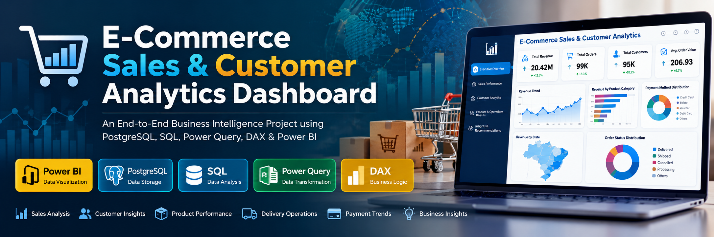
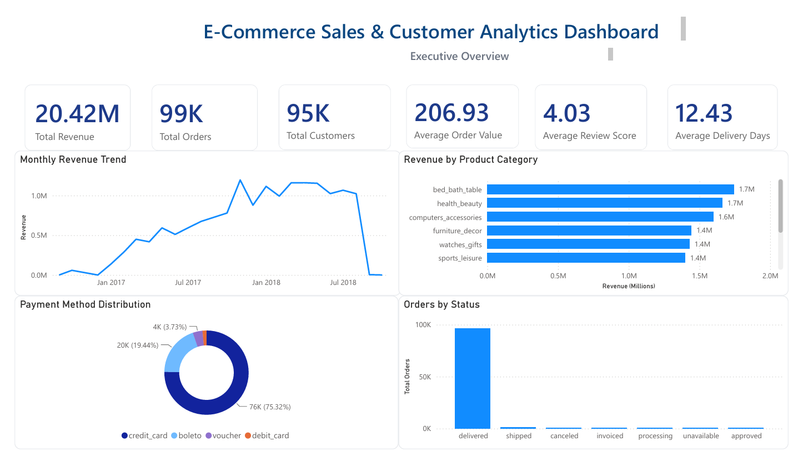
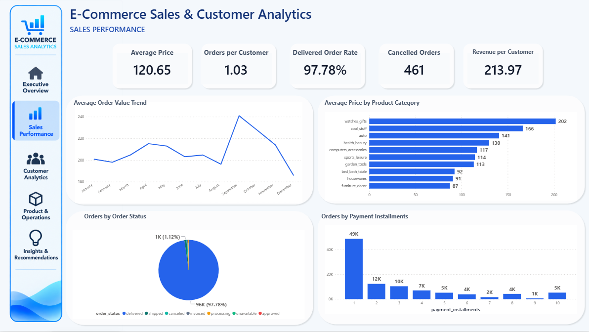
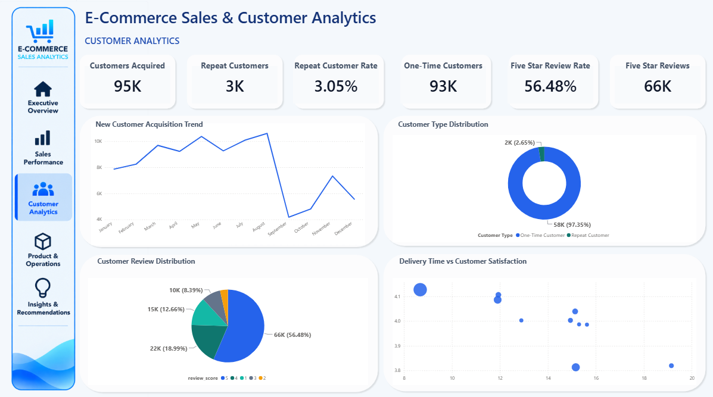
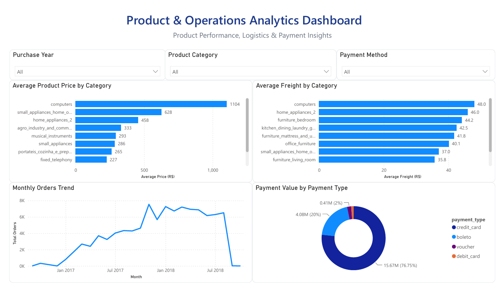
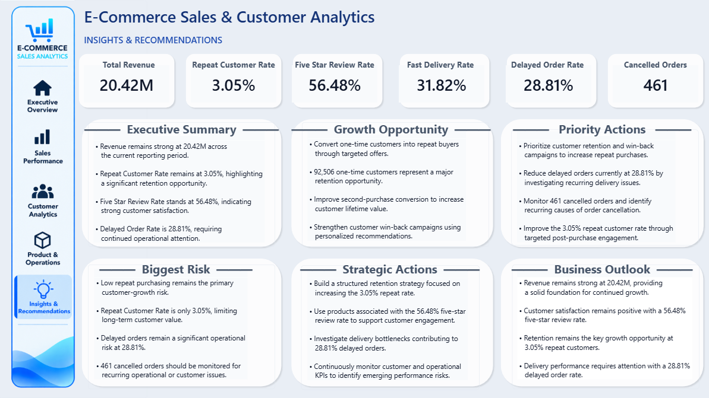
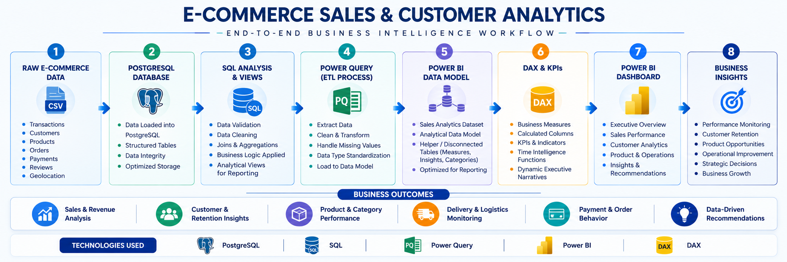
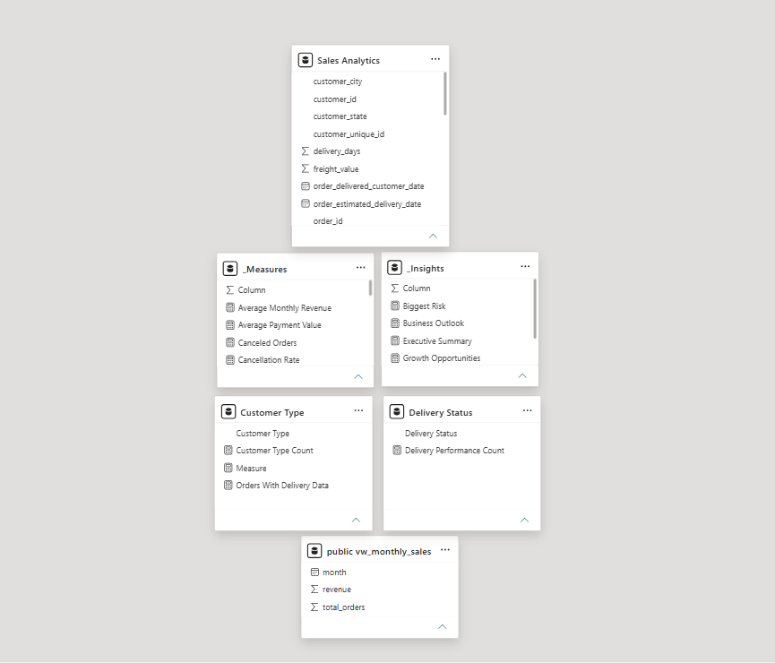

<p align="center">
  
</p>

<h1 align="center">📊 E-Commerce Sales & Customer Analytics Dashboard</h1>

<p align="center">
  An End-to-End Business Intelligence Project using PostgreSQL, SQL, Power Query, DAX & Power BI
</p>

<p align="center">


</p>

---

# 📌 Project Overview

**E-Commerce Sales & Customer Analytics Dashboard** is an end-to-end Business Intelligence project designed to analyze e-commerce sales performance, customer behavior, product performance, delivery operations, payment trends, and business opportunities.

The project transforms raw transactional data into an interactive Power BI reporting solution using:

- **PostgreSQL** for data storage and SQL analysis
- **SQL** for data validation, transformation, analysis, and analytical views
- **Power Query** for ETL and data preparation
- **DAX** for business logic, KPIs, analytical measures, and dynamic executive insights
- **Power BI** for interactive dashboards, data visualization, and business storytelling

The project follows a complete analytics workflow:

**Raw Data → PostgreSQL → SQL Analysis → Data Transformation → Data Modeling → DAX → Power BI → Business Insights**

---

# 🎯 Project Objectives

The primary objectives of this project are to:

- Analyze overall e-commerce sales performance
- Monitor revenue and order trends
- Understand customer purchasing behavior
- Measure repeat customer activity and retention opportunities
- Analyze customer review and satisfaction patterns
- Evaluate product and category performance
- Analyze delivery and logistics performance
- Understand payment behavior
- Identify operational risks and business opportunities
- Provide actionable recommendations through executive-level insights

---

# 📊 Dashboard Overview

The final Power BI report contains **five analytical pages**, each designed for a specific business question.

### 1. Executive Overview

Provides a high-level view of overall business performance.

Key areas:

- Revenue
- Orders
- Customers
- Average Order Value
- Customer Review Score
- Delivery Performance
- Revenue by Product Category
- Payment Method Distribution
- State-level Revenue Performance

---

### 2. Sales Performance

Focuses on purchasing and sales behavior.

Key areas:

- Average Price
- Orders per Customer
- Delivered Order Rate
- Cancelled Orders
- Revenue per Customer
- Average Order Value Trend
- Average Price by Product Category
- Order Status Distribution
- Payment Installment Behavior

---

### 3. Customer Analytics

Focuses on customer acquisition, retention, purchasing behavior, and satisfaction.

Key areas:

- Customers Acquired
- Repeat Customers
- Repeat Customer Rate
- One-Time Customers
- Five Star Review Rate
- Five Star Reviews
- New Customer Acquisition Trend
- Customer Type Distribution
- Customer Review Distribution
- Delivery Time vs Customer Satisfaction

---

### 4. Product & Operations

Focuses on product portfolio and operational performance.

Key areas:

- Total Products
- Product Categories
- Average Freight
- Average Delivery Days
- Fast Delivery Rate
- Delayed Order Rate
- Revenue by Product Category
- Product Price vs Freight
- Average Delivery Time Trend
- Delivery Performance Mix

---

### 5. Insights & Recommendations

The executive decision-support page converts analytical results into business actions.

The page contains dynamic KPI cards for:

- Total Revenue
- Repeat Customer Rate
- Five Star Review Rate
- Fast Delivery Rate
- Delayed Order Rate
- Cancelled Orders

It also provides dynamic DAX-driven executive narratives covering:

- Executive Summary
- Growth Opportunities
- Priority Actions
- Biggest Risk
- Strategic Actions
- Business Outlook

The narrative sections respond dynamically to Power BI filters and slicers.

---

# 📸 Dashboard Preview

## 📈 Executive Overview

<p align="center">
  
</p>

---

## 💰 Sales Performance

<p align="center">
  
</p>

---

## 👥 Customer Analytics

<p align="center">
  
</p>

---

## 📦 Product & Operations

<p align="center">
  
</p>

---

## 💡 Insights & Recommendations

<p align="center">
  
</p>

---

# 🏗️ Business Intelligence Architecture

The project follows a structured Business Intelligence architecture that transforms raw transactional data into analytical datasets and interactive business dashboards.

<p align="center">
  
</p>

### Workflow

```text
Raw E-Commerce Data
        ↓
   PostgreSQL
        ↓
SQL Validation & Cleaning
        ↓
Exploratory Data Analysis
        ↓
SQL Views & Analytical Dataset
        ↓
Power Query ETL
        ↓
Power BI Data Model
        ↓
DAX Measures & KPIs
        ↓
Interactive Dashboards
        ↓
Business Insights & Recommendations
```

---

# 📊 Data Model

The Power BI report uses an analytical data model centered around the **Sales Analytics** dataset.

The model supports:

- Sales analysis
- Customer analysis
- Product analysis
- Payment analysis
- Review analysis
- Delivery analysis
- KPI development
- Executive reporting

<p align="center">
  
</p>

---

# 🗄️ SQL Views

SQL views were created in PostgreSQL to simplify analytical reporting and provide reusable datasets for Power BI.

| SQL View | Description |
|----------|-------------|
| `Sales Analytics` | Primary analytical dataset used for Power BI reporting |
| `vw_monthly_sales` | Monthly sales and order trend analysis |

The SQL workflow also includes data validation, cleaning, exploratory analysis, business analysis, customer segmentation, analytical views, and query optimization.

---

# 📈 DAX Measures

DAX is used extensively throughout the Power BI report to create reusable business metrics and dynamic analytical calculations.

### Core Business Measures

| Measure | Purpose |
|---------|---------|
| Total Revenue | Calculates total sales revenue |
| Total Orders | Counts unique customer orders |
| Total Customers | Counts unique customers |
| Average Order Value | Calculates average revenue per order |
| Average Review Score | Calculates average customer rating |
| Average Delivery Days | Calculates average delivery duration |
| Average Price | Calculates average product price |
| Average Freight | Calculates average freight value |
| Total Products | Counts unique products |

### Customer Measures

| Measure | Purpose |
|---------|---------|
| New Customers | Identifies customers acquired during the reporting period |
| Repeat Customers | Counts customers with more than one order |
| Repeat Customer Rate | Measures the percentage of repeat customers |
| One-Time Customers | Counts customers with exactly one order |
| Five Star Reviews | Counts five-star reviews |
| Five Star Review Rate | Measures the share of five-star reviews |

### Sales & Operations Measures

| Measure | Purpose |
|---------|---------|
| Orders per Customer | Measures average orders per customer |
| Revenue per Customer | Measures revenue generated per customer |
| Delivered Orders | Counts delivered orders |
| Delivered Order Rate | Measures delivered orders as a percentage of total orders |
| Cancelled Orders | Counts cancelled orders |
| Cancellation Rate | Measures cancelled orders as a percentage of orders |
| Fast Delivery Orders | Counts orders delivered within the fast-delivery threshold |
| Fast Delivery Rate | Measures fast-delivery performance |
| Delayed Orders | Counts orders exceeding the delayed-delivery threshold |
| Delayed Order Rate | Measures delayed-delivery performance |

### Executive Intelligence

Additional DAX text measures dynamically generate:

- Executive Summary
- Growth Opportunities
- Priority Actions
- Biggest Risk
- Strategic Actions
- Business Outlook

These measures use the current filter context so executive insights update dynamically when users interact with the report.

---

# 💡 Key Business Insights

The completed dashboard provides insights across revenue, customers, products, and operations.

## 📈 Executive Overview

- Generated approximately **20.42M** in total revenue.
- Processed approximately **99K orders**.
- Served approximately **95K unique customers**.
- Average Order Value is approximately **206.93**.
- Average customer review score is approximately **4.03 / 5**.
- Average delivery time is approximately **12.43 days**.
- Revenue is concentrated among several major product categories and geographic markets.
- Credit Card is the dominant payment method.

---

## 💰 Sales Performance

- Average product price is approximately **120.65**.
- Average orders per customer is approximately **1.03**.
- Delivered orders represent a very high proportion of total orders.
- Approximately **461 orders are cancelled**.
- Revenue per customer is approximately **213.97**.
- Average Order Value varies throughout the reporting period.
- Payment installment behavior varies across customers and orders.

---

## 👥 Customer Analytics

- Repeat Customer Rate is approximately **3.05%**.
- One-time customers represent the overwhelming majority of the customer base.
- This creates a significant opportunity for customer retention and second-purchase strategies.
- Five-star reviews represent approximately **56.48%** of reviewed orders.
- Customer review distribution indicates generally positive customer experiences.
- Delivery performance varies across geographic segments.

---

## 📦 Product & Operations

- The product portfolio contains approximately **33K products** across **74 categories**.
- Average freight is approximately **20.03**.
- Average delivery time is approximately **12.43 days**.
- Fast Delivery Rate is approximately **31.82%**.
- Delayed Order Rate is approximately **28.81%**.
- Delivery performance represents an important operational improvement opportunity.
- Product price and freight relationships vary across product categories.

---

# 💡 Executive Recommendations

### Customer Retention

The low repeat customer rate represents the strongest customer-growth opportunity.

Recommended actions:

- Develop second-purchase campaigns
- Launch targeted win-back campaigns
- Use personalized product recommendations
- Improve post-purchase engagement

### Delivery Performance

The delayed order rate indicates a significant logistics improvement opportunity.

Recommended actions:

- Identify consistently delayed geographic segments
- Investigate delivery bottlenecks
- Review fulfillment performance
- Monitor delivery KPIs continuously

### Customer Experience

The strong five-star review rate indicates a positive customer experience across a significant portion of reviewed orders.

Recommended actions:

- Identify products associated with strong customer satisfaction
- Promote high-performing product categories
- Use positive customer feedback to support retention initiatives

---

# 🛠️ Tech Stack

| Category | Technology | Purpose |
|----------|------------|---------|
| 🗄️ Database | PostgreSQL | Store and manage transactional data |
| 💻 Query Language | SQL | Data extraction, transformation, validation, and analysis |
| 🔄 ETL | Power Query | Data cleaning and transformation |
| 📊 Data Modeling | Power BI | Build analytical data models |
| 📈 Business Logic | DAX | Create KPIs, calculations, and dynamic insights |
| 📉 Visualization | Power BI | Interactive dashboards and reporting |
| 🐍 Analytics | Python | Data analysis and supporting analytical workflows |
| 🌐 Version Control | Git & GitHub | Source control and portfolio management |

---

# ▶️ Installation & Usage

## Prerequisites

Before opening the project, ensure you have:

- Power BI Desktop
- PostgreSQL, if using the database connection
- Git, if cloning the repository

## Steps to Run

1. Clone or download the repository.
2. Open the `.pbix` file using **Power BI Desktop**.
3. If prompted, update the PostgreSQL database connection.
4. Refresh the dataset.
5. Review the data model and measures.
6. Explore the five dashboard pages.
7. Use available slicers, filters, and cross-filtering interactions to analyze the data dynamically.

---

# 📁 Repository Contents

```text
Ecommerce-Sales-Customer-Analytics/
│
├── Dashboard/
│   └── Ecommerce_Sales_Analytics.pbix
│
├── Images/
│   ├── banner.png
│   ├── architecture.png
│   ├── executive-overview.png
│   ├── sales-performance.png
│   ├── customer-analytics.png
│   ├── product-operations.png
│   ├── insights-recommendations.png
│   └── data-model.png
│
├── SQL/
│   ├── 01_Create_Database.sql
│   ├── 02_Create_Tables.sql
│   ├── 03_Import_Data.sql
│   ├── 04_Data_Validation.sql
│   ├── 05_Data_Cleaning.sql
│   ├── 06_Exploratory_Data_Analysis.sql
│   ├── 07_Business_Analysis.sql
│   ├── 08_RFM_Customer_Segmentation.sql
│   ├── 09_Views.sql
│   ├── 10_Indexes.sql
│   └── 11_Analytics_View.sql
│
├── README.md
└── LICENSE
```

---

# 🗄️ SQL Workflow

The SQL scripts are organized into a structured analytics pipeline:

| Step | Description |
|------|-------------|
| 01 | Create Database |
| 02 | Create Tables |
| 03 | Import Raw Data |
| 04 | Validate Data |
| 05 | Clean Data |
| 06 | Exploratory Data Analysis |
| 07 | Business Analysis |
| 08 | RFM Customer Segmentation |
| 09 | Create SQL Views |
| 10 | Optimize Queries using Indexes |
| 11 | Build Final Analytics View |

The workflow separates database preparation, data validation, analytical processing, and reporting, creating a structured pipeline from raw transactional data to Power BI insights.

---

# 🎯 Skills Demonstrated

This project demonstrates practical Business Intelligence and Data Analytics capabilities, including:

- SQL Querying
- PostgreSQL Database Management
- Data Cleaning & Validation
- Exploratory Data Analysis
- Business Analysis
- RFM Customer Segmentation
- SQL Views
- Query Optimization
- Power Query ETL
- Power BI Data Modeling
- DAX Measures & KPIs
- Interactive Dashboard Development
- Data Visualization
- Business Storytelling
- Customer Analytics
- Product Analytics
- Operational Analytics
- Executive Reporting
- Dynamic DAX Narrative Generation

---

# 🚀 Future Improvements

Potential future enhancements include:

- Profit Analysis Dashboard
- Customer Lifetime Value (CLV)
- Sales Forecasting
- Inventory & Supply Chain Analytics
- Product Recommendation Analysis
- Advanced Customer Segmentation
- Real-Time Dashboard Refresh
- Automated Business Alerts

---

# 👨‍💻 About the Author

**Muhammed Irshad**

Aspiring Data Analyst focused on Business Intelligence, SQL, PostgreSQL, Power BI, DAX, Python, and Data Visualization.

- GitHub: [https://github.com/irshad480](https://github.com/irshad480)
- LinkedIn: [www.linkedin.com/in/muhammed-irshad-b21523360](https://www.linkedin.com/in/muhammed-irshad-b21523360)
- Email: [vvrirshadmk@gmail.com](mailto:vvrirshadmk@gmail.com)

---

# 📄 License

This project is licensed under the **MIT License**.